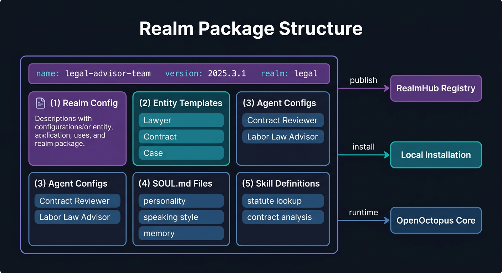
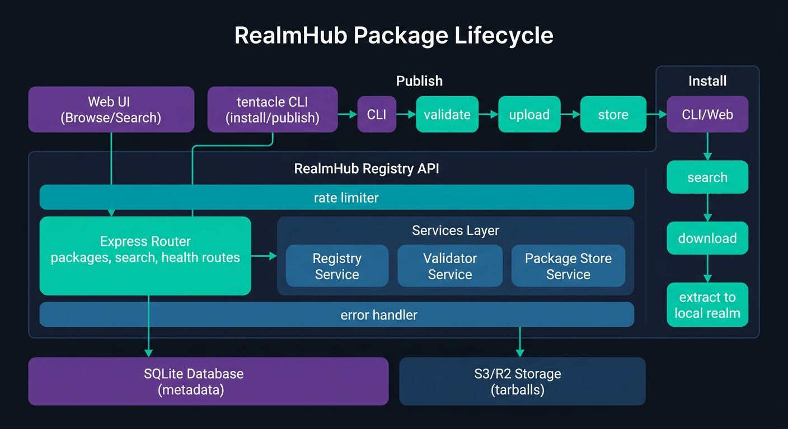

<p align="center">
  <picture>
    <source media="(prefers-color-scheme: light)" srcset="https://raw.githubusercontent.com/open-octopus/openoctopus.club/main/src/assets/brand/logo-dark.png">
    
  </picture>
</p>

<h3 align="center">RealmHub</h3>

<p align="center">
  Realm package marketplace — install complete life domain solutions in one click.
</p>

<p align="center">
  <a href="https://github.com/open-octopus/realmhub/actions/workflows/ci.yml"></a>
  <a href="https://github.com/open-octopus/realmhub/blob/main/LICENSE"></a>
  <a href="#"></a>
  <a href="https://github.com/open-octopus/openoctopus"></a>
  <a href="https://discord.gg/mwNTk8g5fV"></a>
</p>

---

> **Status: Phase 3 — Planned.** Package registry with publish/search/download, API key auth, rate limiting, FTS, and HTML browser with 117 tests passing. Per the [design research](https://github.com/open-octopus/openoctopus/tree/main/docs/research), RealmHub marketplace launches in Phase 3 after the family hub product achieves product-market fit.

## What is RealmHub?

**RealmHub** is the realm package marketplace for [OpenOctopus](https://github.com/open-octopus/openoctopus) — like an app store, but for life domains. Instead of installing individual skills or tools, you install a complete **realm package** that includes entities, agents, SOUL.md personalities, skills, and workflows for an entire life domain.

### How It Relates to the Core

The OpenOctopus core monorepo contains `@openoctopus/realmhub` — a client library that communicates with this registry. This repository houses:

- **Registry API** — Package index, search, versioning, and distribution
- **Web frontend** — Browse, preview, and install realm packages
- **CLI integration** — `tentacle realm install <package>` workflow

## Realm Package Format

<p align="center">
  
</p>

A realm package bundles everything needed for a life domain:

| Component | Description |
|-----------|-------------|
| **Realm Config** | Domain metadata, icon, description |
| **Entity Templates** | Pre-defined entities (e.g., "Lawyer", "Contract", "Case") |
| **Agent Configs** | Domain agents with personalities and proactive rules |
| **SOUL.md Files** | Personality templates for summoned entities |
| **Skill Definitions** | Domain-specific skills (e.g., tax calculation, vet lookup) |

### RealmPackageSchema

```typescript
{
  name: string;         // Package name (e.g., "legal-advisor-team")
  version: string;      // Semantic version (e.g., "1.0.0")
  author?: string;      // Package author
  description: string;  // What this package provides
  realmConfig: { ... }; // Realm definition (name, icon, description, etc.)
  entities: [ ... ];    // Entity templates
  soulFiles: [ ... ];   // SOUL.md personality files
  skills: [ ... ];      // Skill definitions
}
```

## Example Packages

### Legal Advisor Team

A complete legal affairs realm with a team of specialized agents:

- **Entities**: Lawyer, Case, Contract, Legal Document, Statute
- **Agents**: Contract Reviewer, Labor Law Advisor, Case Researcher
- **Skills**: Statute lookup, contract clause analysis, deadline tracking
- **Proactive**: Court date reminders, contract renewal alerts, statute of limitations warnings

### Pet Care

Everything you need to manage your pets' lives:

- **Entities**: Pet, Vet Record, Food Supply, Vaccination Schedule
- **Agents**: Pet Care Expert, Nutrition Advisor
- **Skills**: Vet lookup, feeding schedule, health tracking
- **Proactive**: Vet appointment reminders, flea/tick prevention alerts, weight monitoring

### Family Finance

Personal and household financial management:

- **Entities**: Bank Account, Investment Portfolio, Budget, Insurance Policy
- **Agents**: Budget Advisor, Investment Analyst, Tax Assistant
- **Skills**: Tax calculation, investment analysis, budget planning
- **Proactive**: Bill payment reminders, budget overrun alerts, tax deadline warnings

## Planned CLI

### Discover

```bash
# Search packages by keyword
tentacle realm search "legal"

# Search with filters
tentacle realm search --tag finance --sort downloads

# Browse featured / curated packages
tentacle realm explore

# Preview package details without installing
tentacle realm inspect legal-advisor-team
```

### Install and Manage

```bash
# Install a realm package
tentacle realm install legal-advisor-team

# Install a specific version
tentacle realm install legal-advisor-team@1.2.0

# List installed realm packages
tentacle realm list

# Update all packages
tentacle realm update --all

# Uninstall a package (removes agents/skills, keeps your data)
tentacle realm uninstall legal-advisor-team
```

### Publish

```bash
# Validate your realm package locally
tentacle realm validate ./my-realm-package/

# Login to RealmHub (GitHub OAuth)
tentacle realm login

# Publish to RealmHub
tentacle realm publish ./my-realm-package/

# Update an existing package
tentacle realm publish ./my-realm-package/ --bump minor
```

### Post-Install

After installation, the realm becomes **your personal copy** — fully editable. Customize entities, tweak agent personalities, add your own SOUL.md files, and adjust proactive rules to fit your life.

## Planned Architecture

<p align="center">
  
</p>

## Planned Tech Stack

| Component | Choice |
|-----------|--------|
| Registry API | Node.js + Express |
| Database | PostgreSQL / Supabase |
| Storage | S3-compatible (Cloudflare R2) |
| Web UI | Next.js |
| Search | Full-text + tag-based |
| Auth | GitHub OAuth |

## Planned Repo Layout

```
realmhub/
├── src/                    # Web app (Next.js)
│   ├── app/                # App router pages
│   ├── components/         # UI components
│   └── lib/                # Shared utilities
├── api/                    # Registry API
│   ├── routes/             # Express route handlers
│   ├── services/           # Package storage, search, validation
│   └── middleware/         # Auth, rate limiting
├── packages/
│   └── schema/             # Shared API types for CLI + app
├── docs/                   # Documentation
│   ├── spec.md             # Product + implementation spec
│   ├── cli.md              # CLI reference
│   └── package-format.md   # Package format specification
└── README.md
```

## Planned Local Development

```bash
# Clone
git clone https://github.com/open-octopus/realmhub.git
cd realmhub

# Install
pnpm install

# Environment
cp .env.example .env.local
# Edit .env.local with database URL, API keys, OAuth credentials

# Run API + Web concurrently
pnpm dev

# Run tests
pnpm test

# Lint and format
pnpm check
```

### Environment Variables

| Variable | Description |
|----------|-------------|
| `DATABASE_URL` | PostgreSQL / Supabase connection string |
| `S3_ENDPOINT` | S3-compatible storage endpoint (Cloudflare R2) |
| `S3_BUCKET` | Bucket name for package storage |
| `S3_ACCESS_KEY` | Storage access key |
| `S3_SECRET_KEY` | Storage secret key |
| `GITHUB_CLIENT_ID` | GitHub OAuth app ID |
| `GITHUB_CLIENT_SECRET` | GitHub OAuth secret |
| `REALMHUB_URL` | Public URL (`https://realmhub.openoctopus.club`) |

## Roadmap

- [ ] Package format specification finalized
- [ ] Registry API (upload, search, download)
- [ ] CLI integration (`tentacle realm install/publish`)
- [ ] Web UI for browsing packages
- [ ] Package validation and security scanning
- [ ] Rating and review system
- [ ] Featured/curated packages
- [ ] Vector search (embeddings-based discovery)

## Related Projects

| Project | Description |
|---------|-------------|
| [openoctopus](https://github.com/open-octopus/openoctopus) | Core monorepo — `@openoctopus/realmhub` client library |
| [realms](https://github.com/open-octopus/realms) | Official realm packages archive |
| [soul-gallery](https://github.com/open-octopus/soul-gallery) | Community SOUL.md template gallery |

## Contributing

RealmHub is in the planning phase. Join [The Reef (Discord)](https://discord.gg/mwNTk8g5fV) to discuss the design, or open an issue with ideas for the package format, registry API, or web UI.

See [CONTRIBUTING.md](https://github.com/open-octopus/.github/blob/main/CONTRIBUTING.md) for general guidelines.

## License

[MIT](LICENSE) — see the [.github repo](https://github.com/open-octopus/.github) for the full license text.
